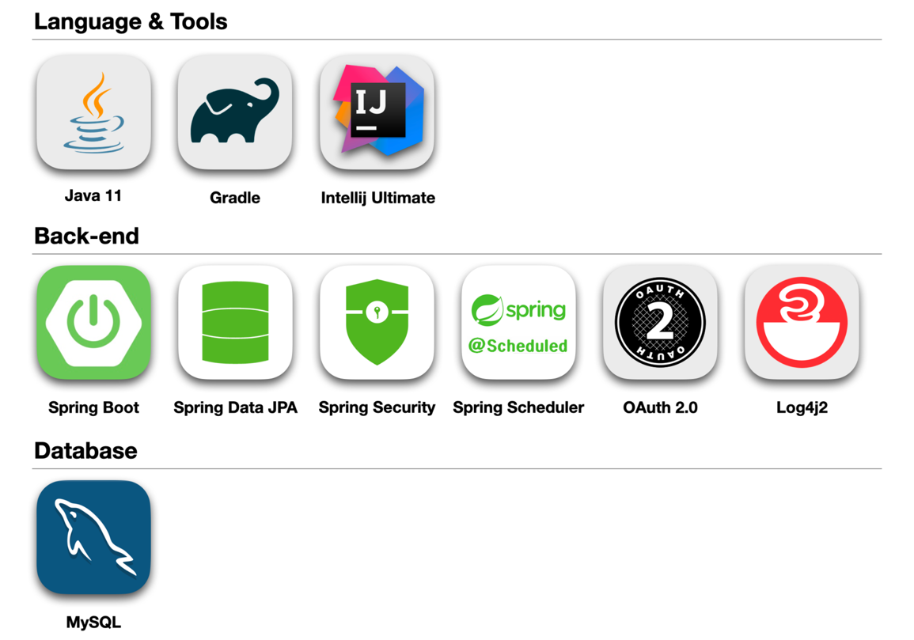
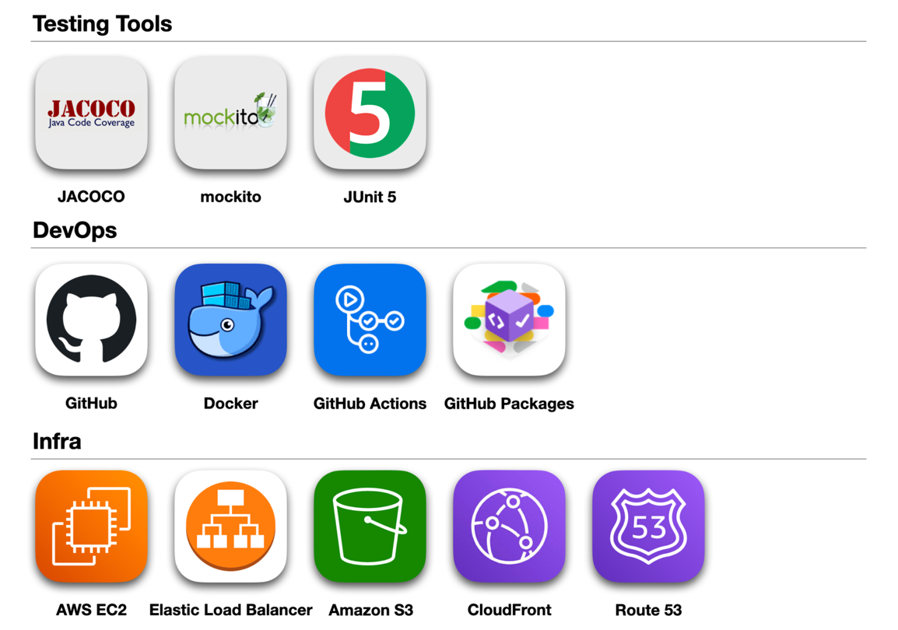
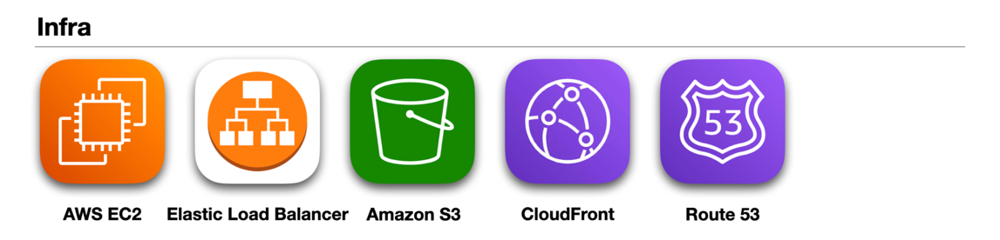
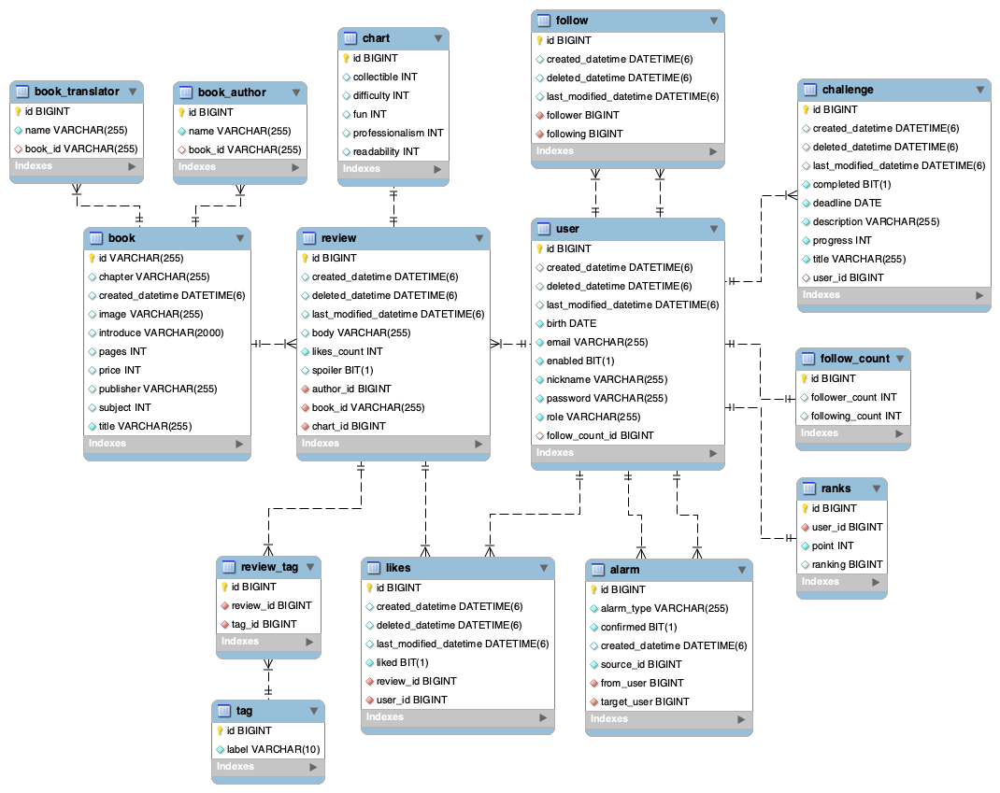
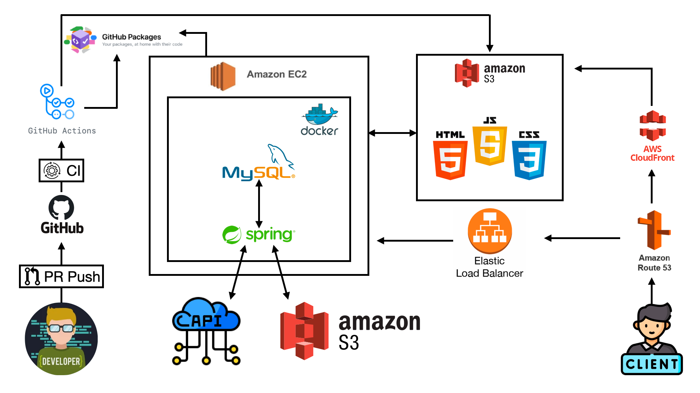

# 📚Book More

### Description

바쁜 현대사회에서 책을 읽는 중요성이 떨어지고 있어서 책에 관해서 자유롭게 이야기를 나누고 생각을 공유할 수 있는 커뮤니티가 활성화된다면 좀 더 책을 읽을 수 있는 분위기가 형성될거라고 생각하여 프로젝트를 진행하게
되었습니다.

 

### 배포
- [Swagger](https://api.bookmore.site/swagger-ui/index.html)
- [홈페이지](https://www.bookmore.site)

 

### 📄 기능 명세서

#### 회원

| METHOD  | URL                 | 기능       |
|---------|---------------------|----------|
| POST    | /api/v1/users/join  | 회원 가입    |
| POST    | /api/v1/users/login | 로그인      |
| PATCH   | /api/v1/users/{id}  | 회원 정보 수정 |
| DELETE  | /api/v1/users/{id}  | 회원 탈퇴    |
| GET     | /api/v1/users/{id}  | 회원 상세 조회 |

#### 랭킹

| METHOD | URL                             | 기능            |
|--------|---------------------------------|---------------|
| GET    | /api/v1/users/ranks/{id}/follow | 개인 티어 & 랭킹 조회 |
| GET    | /api/v1/users/ranks             | 티어 랭킹 리스트 조회  |

#### 팔로잉

| METHOD | URL                          | 기능        |
|--------|------------------------------|-----------|
| POST   | /api/v1/users/{id}/follow    | 팔로잉       |
| DELETE | /api/v1/users/{id}/follow    | 언팔로잉      |
| GET    | /api/v1/users/{id}/following | 유저 팔로잉 조회 |
| GET    | /api/v1/users/{id}/follower  | 유저 팔로워 조회 |

#### 챌린지

| METHOD | URL                     | 기능        |
|--------|-------------------------|-----------|
| POST   | /api/v1/challenges      | 도전 등록     |
| GET    | /api/v1/challenges/{id} | 도전 상세 조회  |
| GET    | /api/v1/challenges      | 도전 리스트 조회 |
| PATCH  | /api/v1/challenges/{id} | 도전 수정     |
| DELETE | /api/v1/challenges/{id} | 도전 삭제     |

#### 리뷰

| METHOD | URL                              | 기능                 |
|--------|----------------------------------|--------------------|
| POST   | /api/v1/books/{isbn}/reviews     | 도서 리뷰 등록           |
| GET    | /api/v1/books/{isbn}/reviews     | 도서 리뷰 조회           |
| PATCH  | /api/v1/books/reviews/{id}       | 도서 리뷰 수정           |
| DELETE | /api/v1/books/reviews/{id}       | 도서 리뷰 삭제           |
| POST   | /api/v1/books/reviews/{id}/likes | 도서 리뷰 좋아요 / 좋아요 취소 |

#### 책

| METHOD | URL                                                 | 기능       |
|--------|-----------------------------------------------------|----------|
| GET    | /api/v1/books?query={title}&page={page}&size={size} | 도서 검색    |
| GET    | /api/v1/books/{isbn}                                | 도서 상세 조회 |

####  알림

| METHOD | URL            | 기능            |
|--------|----------------|---------------|
| GET    | /api/v1/alarms | 팔로잉의 리뷰 등록 알림 |
| GET    | /api/v1/alarms | 나를 팔로잉하면 알림   |
| GET    | /api/v1/alarms | 내 리뷰에 좋아요 알림  |

  

<h1> 📚 BookMore[북: 모아] </h1>
<h3> 리뷰를 모아모아 독서량을 늘리자!</h3>

# 📝 프로젝트 소개

## ⚒️ 기술 스택

### 📍 ERD

##  🪜 Architecture

# 🙋🏻‍♂️🙋🏻‍♀️ 팀원 소개

|                  CTO, Backend                  |                Infra, Backend                 |           Project Manager, Backend           |                    Backend                     |                     Backend                     |                 Planner, Backend                  |
|:----------------------------------------------:|:---------------------------------------------:|:--------------------------------------------:|:----------------------------------------------:|:-----------------------------------------------:|:-------------------------------------------------:|
|  |  |  |  |  |  |
|     [👑황민우](https://github.com/menuhwang)      |      [이연재](https://github.com/yjyj1023)       |      [장서현](https://github.com/Senna97)       |      [심현보](https://github.com/simhyunbo)       |      [우주완](https://github.com/Universenn)       |      [김지영](https://github.com/Kim-Ji-Yeong)       |

# 🏠 팀 문화